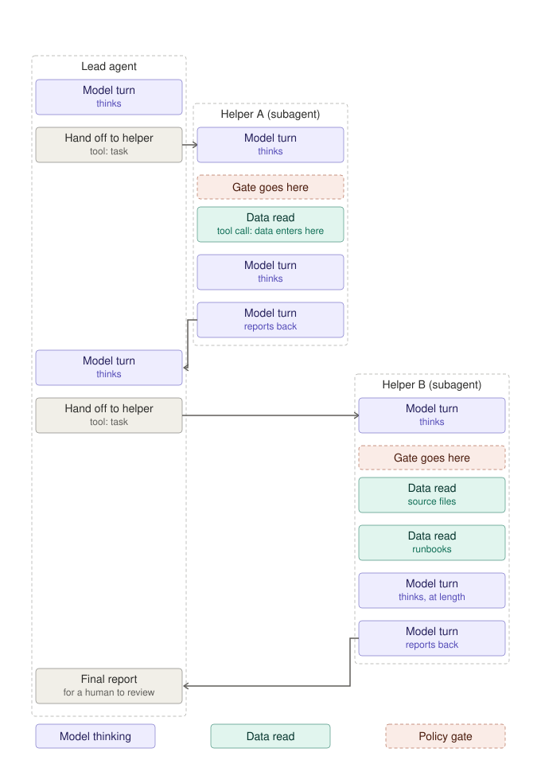
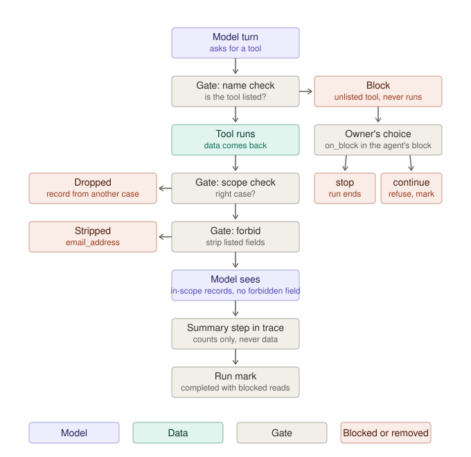
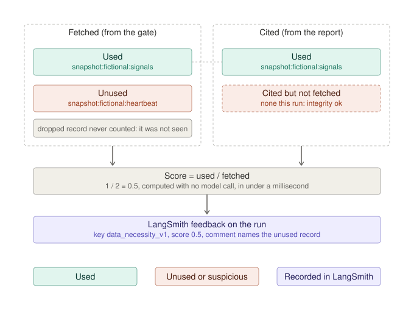

# Agent data scope

A governance layer for [LangChain Deep Agents](https://github.com/langchain-ai/deepagents) that proves an agent touched only the data its task needed.

Governance teams do not read traces. They approve a policy, and they ask, across every agent, how often the rules were followed and what happened when they were not. This project answers that question with four parts, all deterministic, none of which put data into the evidence.

| Part | What it is |
|---|---|
| **1. Scope declaration** | A YAML policy with three kinds of rule. `permit` and `forbid` are hard and enforced. `expect` is soft and scored. Every permitted source carries a sensitivity tier in your organization's own vocabulary. A one-page policy card is generated from the same file for approval. |
| **2. Enforcement at the tool boundary** | A middleware gate on every tool call, in every agent and subagent. It permits by name, drops records from other cases, strips forbidden fields before the model sees them, and applies the agent owner's `on_block` choice. Every decision is one evidence line (names and counts, never data) and one named step in the LangSmith trace. |
| **3. Necessity scoring** | Fetched versus cited, computed with no model call and posted to LangSmith as feedback. Allowed is not the same as needed; this is where the two come apart. |
| **4. Evidence for governance** | A fleet report across agents for a period, built from LangSmith (or a local ledger), plus incidents with an owner and a state, posted as feedback so a LangSmith alert can notify people. |

## Why the trace is not the evidence

A trace records what tools ran and how long the model thought. In a regulated setting, inputs and outputs are usually redacted, so the trace cannot say which records or fields an agent saw. The gate writes a third kind of record: metadata about the data. "Read incident 4471, fields status and queue depth, allowed under rule 2, fields email and phone stripped." Nothing sensitive in it, and it answers the question the trace cannot.



## One tool call through the gate



Two things this diagram makes visible. The gate sits on every subagent, because middleware on a lead agent does not flow down to its helpers, and the helpers do the reading. And a blocked call is not allowed to look normal: with `on_block: continue` the run is marked "completed with blocked reads" and never reported as clean.

## Allowed is not needed



This score is a floor, not a verdict. A record can be needed without being cited, and citing everything would game the ratio. It is deterministic, it costs nothing, and it is the signal that catches drift: an agent whose unused list grows week over week.

## Incidents

Three rules turn a gate event into something with an owner and a state instead of a statistic:

- **Sensitive gate action.** A block, drop, or strip on a source whose tier is in `incidents.sensitive_tiers`. Nothing reached the model; something upstream drifted.
- **Integrity.** A report cited evidence the gate never let through. Either a bypass or an invented reference.
- **Necessity streak.** Necessity below the floor for N runs in a row.

Incidents move `open`, `acknowledged`, `remediated`, `closed`. Each run posts LangSmith feedback under the policy's `incidents.feedback_key`; set a [LangSmith alert](https://docs.langchain.com/langsmith/alerts) on that key to notify the owner.

## Repository layout

```
policies/example-scope.yaml   the policy, single source for enforcement and the card
policies/example-scope.md     the generated policy card (do not edit by hand)
typescript/                   the TypeScript package, tests, and the lesson
python/                       the Python port
docs/                         the diagrams
```

## TypeScript quick start

```bash
cd typescript
npm install
npm run check          # typecheck, tests, and card-is-current
npm run lesson         # a fictional agent, no model key needed: one permit, one block, one drop, one strip
npm run lesson -- --sci-probe          # adds a sensitive-tier source so a strip becomes an incident
npm run report -- --source ledger --days 1
npm run incident       # list incidents; add --id <id> --state acknowledged --note "..." to move one
npm run card           # regenerate policies/example-scope.md from the policy
```

With `LANGSMITH_API_KEY` set, the lesson traces to a LangSmith project (default `agent-data-scope-lesson`), posts necessity and incident feedback, and `npm run report -- --source langsmith --projects agent-data-scope-lesson` builds the fleet report from LangSmith.

To attach the gate to your own Deep Agent, create it per agent and put it first in each agent's and each subagent's middleware list:

```ts
import { createDataScopeGate, loadScopePolicy } from "./src/gate.js";

const policy = loadScopePolicy("policies/example-scope.yaml");
const agent = createDeepAgent({
  tools: [...],
  middleware: [createDataScopeGate({ policy, agent: "example-investigator", context: { incident: { id: incidentId } } })],
});
```

## Composing with the platform's own policy engine

The policy governs the data boundary. LangSmith's LLM Gateway governs the model boundary (spend, rate limits, personal-data and secrets detection), and Fleet governs tool access. They compose: our policy can be *derived into* their settings without absorbing them.

```bash
npm run derive      # read-only: lists the workspace's gateway policies and prints what this policy implies
```

Today that derivation is one rule: an agent that may read a sensitive-tier source gets a personal-data guard at the model boundary. Keys are a platform fact, not a governance fact, so they live in a local bindings file (`typescript/local/langsmith-bindings.yaml`, not committed), never in the policy. The command never creates, updates, or deletes anything; an administrator applies the derived settings with the platform's own tools. That is a deliberate boundary: this project is the missing layer, not a platform.

## Python quick start

```bash
cd python
uv venv --python 3.12 && uv pip install -e ".[dev]"
uv run pytest -q                                   # 38 offline tests
uv run agent-data-scope lesson                     # same fictional lesson, no model key needed
uv run agent-data-scope lesson --sci-probe         # a strip on a sensitive-tier source becomes an incident
uv run agent-data-scope report --source ledger --days 1
uv run agent-data-scope incident                   # list; add --id <id> --state acknowledged --note "..." to move one
uv run agent-data-scope card --check               # the Python card lives at python/example-scope.md
```

The two ports share the policy file, the trace step names, the feedback keys, and the ledger and incident record shapes, so a report built in one can read runs recorded by the other. Details and the differences found in the Python framework are in [python/README.md](python/README.md).

```python
from deepagents import create_deep_agent
from agent_data_scope.gate import create_data_scope_gate
from agent_data_scope.policy import load_scope_policy

policy = load_scope_policy("policies/example-scope.yaml")
agent = create_deep_agent(
    tools=[...],
    middleware=[create_data_scope_gate(policy, "example-investigator", context={"incident": {"id": incident_id}})],
)
```

## Design notes

- **The gate does not guess sensitivity.** Tiers are declared by the agent's owner in the policy and approved by governance. The gate enforces and reports on the declaration.
- **Deterministic by default.** Permit, forbid, scope, necessity, and incidents are all rules. A model judge can sit on top of necessity, off the critical path, if the rules are not enough.
- **Latency.** A gate decision is a lookup and a JSON walk, about a millisecond. A model turn is seconds.
- **LangSmith as the source of truth** for the fleet report, because that is where every other trace already goes and the report contains no data. A local ledger source exists for teams that prefer their own store; both produce identical records.
- **Feedback posted before LangSmith has ingested the run is silently dropped.** The recorders wait until the run is readable before posting.

## Status

Built in one day on a real support agent, then extracted. The policy format, the trace step names, and the feedback keys are the interfaces; everything else is small. Contributions and criticism welcome.

MIT licensed.
